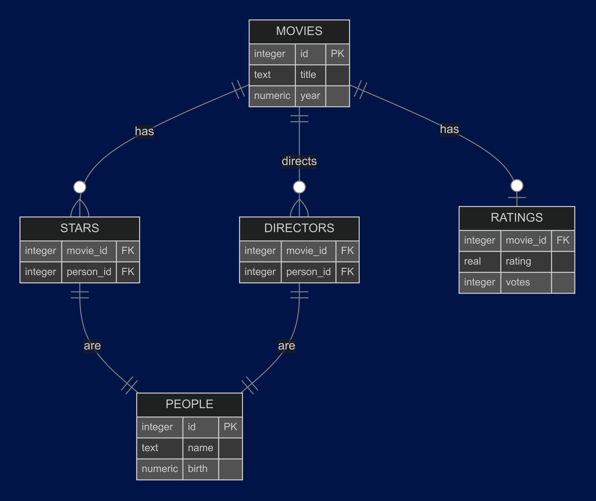

# FlickFinder: Movie Search Application

  
  
  

FlickFinder is a back-end focused movie search application that allows users to query movies and people (actors/directors) from a SQLite database.  
This project was originally developed as part of a university coursework, with a REST API exposing movie data and supporting flexible queries.

---

### Features

- Retrieve a list of movies (limitable)  
- Retrieve movie details by ID  
- Retrieve all people in the database (actors, directors)  
- Retrieve person details by ID  
- Retrieve stars of a specific movie  
- Retrieve movies starring a specific person  
- Filter movies by year, rating, and minimum number of votes  
- RESTful API built using Java & Javalin  
- SQLite database with 400k+ movies and 1.2M+ people

---

### Tech Stack

- **Java 17** — application logic and API  
- **Javalin 5.x** — lightweight REST framework  
- **SQLite 3** — database containing movie and people data  
- **JUnit 5** — unit and integration testing  
- **MVC Pattern** — separation of concerns (models, controllers, routes)  

---

## Database
The database is a simple SQLite database that contains information about movies, people, and their relationships:

---

### License

© 2026 Tamara Sovcikova. All rights reserved.
Public for portfolio purposes only; do not modify or redistribute.
